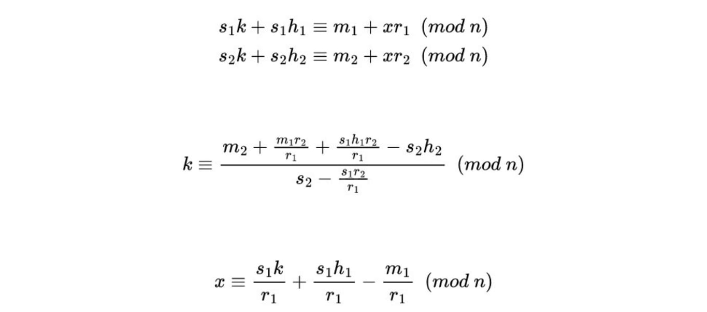

## Leaking Encryption (Crypto, hard)

#### Source code analysis
We are given the Python source code of the [server](chall.py) and we can conect to the server, where we can choose from three options:

1. Test some ideas ```hint()```
2. Attempt solution ```test()```
3. Reboot server ```exit(0)```

By inspecting the python source code I found out it uses the ECDSA encryption. Elliptic curve digital signature algorithm can be very vulnerable if we use a biased nonce. In our case the nonce is a sum of a random number, which stays the same during one session, and a hash of our message, which we can easily retrieve from digest() function. 

```
k = digest(privkey.secret_multiplier) + digest(message)
sig = privkey.sign(message, k)
```

We can also choose the first option on server and it gives us a hint, by signing any string we input:

```python
def hint():
    inp = input("Enter message to sign in hex: ")
    try:
        m = int.from_bytes(bytes.fromhex(inp), 'big')
        k = digest(privkey.secret_multiplier) + digest(m)
        sig = privkey.sign(m, k)
        print("r:", sig.r)
        print("s:", sig.s)
    except:
        print("Unable to sign the message")
```
The goal is to obtain r and s which were used to sign the message (in little endian):
```python
def test():
    m = int.from_bytes(token_bytes(64), 'big')
    print("Please sign this for me: ", m)
    try:
        r = int.from_bytes(bytes.fromhex(input("Enter R in hex: ")), 'little')
        s = int.from_bytes(bytes.fromhex(input("Enter S in hex: ")), 'little')
        sig = Signature(r, s)
        if time() < start_time + 10.1 and pubkey.verifies(m, sig):
            done(m)
    except Exception:
        print("Unable to verify the signature")
```

#### Solution
This system is vulnerable because the nonce always has the same base. To get k, we only need two different signatures from two messages. From the system of two equations I derived k and then x (private key), using Gaussian elimination. 



It's important to use inverse module for the denominator of the fraction. And this is how we obtain the private key:
```python
order = 115792089210356248762697446949407573529996955224135760342422259061068512044369
# We send two random hex strings to server
message1 = int.from_bytes(bytes.fromhex("11"), 'big')
message2 = int.from_bytes(bytes.fromhex("12"), 'big')
h1 = digest(message1)
h2 = digest(message2)

# Can be obtained from the server
r1,r2,s1,s2 = ... 

k_rac = (message2 - message1*r2*inverse_mod(r1, order) + s1*h1*r2*inverse_mod(r1,order) - (s2*h2))*inverse_mod(s2-s1*r2*inverse_mod(r1,order),order) % order
x_rac = (s1*k_rac*inverse_mod(r1,order) + s1*h1*inverse_mod(r1,order) - message1*inverse_mod(r1,order)) % order
```

Now that we have the private key we can initialise the generator and sign the message:
```python
...
# Init
G = generator_256
d = x_rac
pubkey = Public_key(G, d*G)
privkey = Private_key(pubkey, d)

messageToSign = int.from_bytes(bytes.fromhex(message), 'big')

# Signing the message
k = k_rac + digest(messageToSign)
sig = privkey.sign(messageToSign, k)

def toLittleEndian(h):
  a = bytearray.fromhex(str(h)[2:len(h)+2])
  a.reverse()
  h = ''.join(format(x, '02x') for x in a)

# Turning r and s to little endian
r = toLittleEndian(bytes(hex(sig.r)[2:],"utf-8"))
s = toLittleEndian(bytes(hex(sig.s)[2:],"utf-8"))
```

And voila we have r and s. If we choose the second option and send them to the server it returns us some encrypted text and its IV. It is encrypted using AES CFB mode, and the key is calculated from ECDSA private key and message digest. The solution:

```python
text = b't*\xca%\xf4\xbd\x1b\x1f,\xc9\xdb\x18\xba\x85V\xd3\xd8\x00t*\x08\xed\xbaX\x8a\xbe\xf0\x8eU\xe7.\xf9\x8f\x81\x00|rg\xde\xaaa\x12\xfb\x16\x82\xe9\x123'
iv = b'\xb9\x84\xb5\x05\xce\x94\x91ZG\x8e/\xe6D\x99_\x90'

key = bytes.fromhex("%032x" % digest(privkey.secret_multiplier))
key += bytes.fromhex("%032x" % digest(m))

enc = AES.new(key, AES.MODE_CFB, iv).decrypt(text)
print(enc)
```
Which decrypts the flag: `b'7ce29af4-8c2d-49f0-b7df-a51e9393dab5'`.