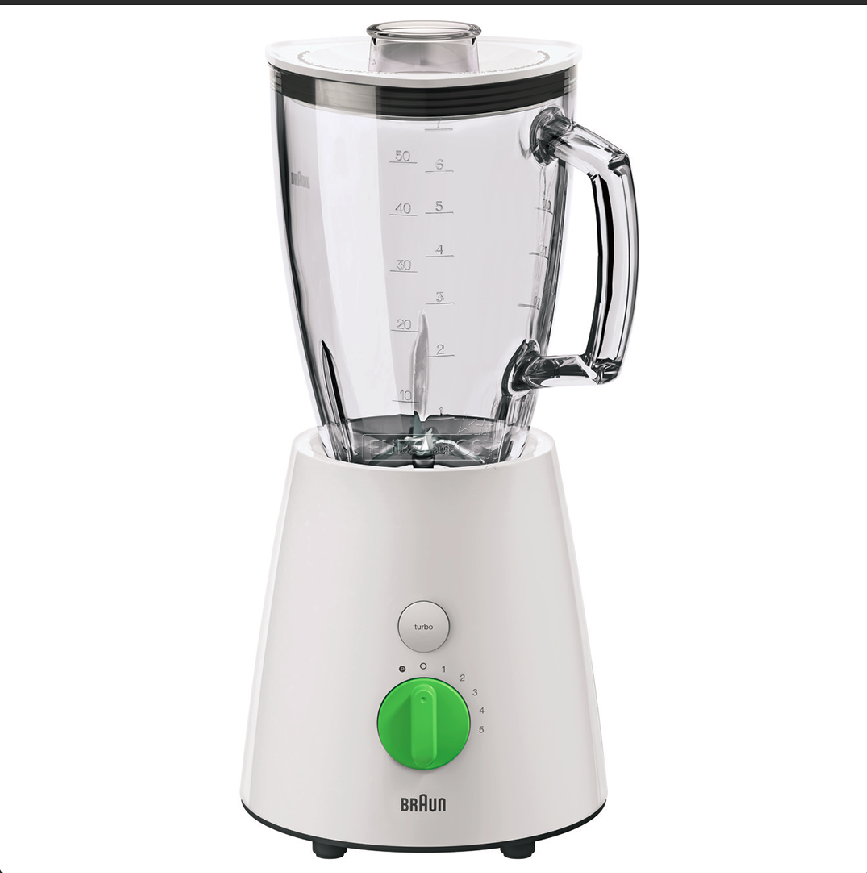

## Let's Blend in (Misc, medium) - BackdoorCTF 2022

We are given the following png file:


If we run `pngcheck -v blender.png` it prints out that there is some additional data after IEND chunk. We can split the png into chunks with `pngsplit blender.png` and then we are going to inspect the last one (after the IEND chunk). It is a zip file, after unzipping we are left with 5 png files, named 'b', 'l', 'e', 'n' and 'd'. We need to extract their pixel values, which can be easily done using the python PIL library Image module. It is important to extract them in the order b -> l -> e -> n -> d, and the values need to be converted to ASCII.


```python
from PIL import Image

text = []
pngs_order = "blend"

for file in pngs_order:
    img = Image.open(file+'.png')
    text += list(img.getdata()) + [10]

for r in text:
    print(chr(r), end = "")
```
The output of the above program is:
```
bpy.ops.object.text_add()
ob=bpy.context.object
ob.data.body = "-... --- .-. -"
bpy.ops.object.text_add(location=(5,0,0))
ob=bpy.context.object
ob.data.body = ". - --- ... - .- -"
bpy.ops.object.text_add(location=(10,0,0))
ob=bpy.context.object
ob.data.body = ". -.. --- ..- - ."
bpy.ops.object.text_add(location=(15,0,0))
ob=bpy.context.object
ob.data.body = ".. --- .-- --"
bpy.ops.object.text_add(location=(20,0,0))
ob=bpy.context.object
ob.data.body = "- -. .----. - -... .-.. . -. -.."
```
This is a python program using the bpy library, which is the Python API for Blender. We can also see some morse code which can be copied and combined into one string:
```
-... --- .-. -. - --- ... - .- -. -.. --- ..- - ... --- .-- --- -. .----. - -... .-.. . -. -..
```

And then we can put it into an online morse translator (for example https://www.dcode.fr/morse-code) to get the flag `BORNTOSTANDOUTSOWON'TBLEND`.